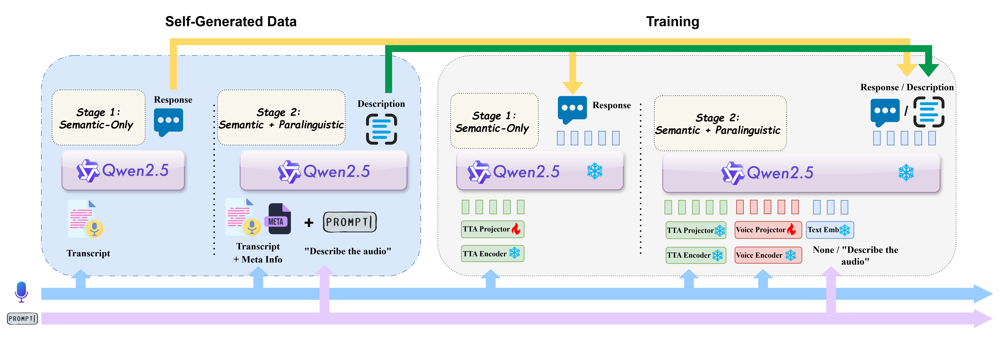

# AZeroS Example

This example demonstrates training and evaluating an AZeroS model.

It follows the same layout as other examples and integrates with Auden's Auto* APIs and BaseTrainer.

## Data Configs
Please refer to `configs/README.md` for data preparation and formats.

Edit YAMLs under `configs/` to point to your Lhotse CutSet `jsonl.gz` manifests.
See `data_module.py` docstring for a minimal supervision schema with LLM instruction and response.

## Training
We adopt a 2-stage training procedure as follows.

- `scripts/train_stage1.sh`: Training a semantic encoder projector.
- `scripts/train_stage2.sh`: Training a paralinguistic encoder projector with the pretrained semantic branch.

## Inference Guide
Run `model.generate` for batch decoding.

Demo of usage:
```bash
python evaluate.py \
  exp_dir=your/exp/dir \
  checkpoint.filename=your_model_file_name.pt \
  data.test_data_config=configs/test_data_config.yaml
```

---

## 🔥 Release of AZeroS
### 🤗 HuggingFace Checkpoint https://huggingface.co/AudenAI/azeros
```python
import torch
from model import AZerosModel

device = "cuda" if torch.cuda.is_available() else "cpu"
model = AZerosModel.from_pretrained("AudenAI/azeros").to(device)

wav_files = ["speech1.wav", "speech2.wav", "speech3.wav"]
messages = [
    [
        {
            "role": "user",
            "content": f"{model.audio_token_wrapped} Please analyze speech content and paralinguistic information.",
        }
    ]
    for _ in wav_files
]

generate_config = {
    "max_new_tokens": 200,
    "num_beams": 1,
    "do_sample": False,
    "min_length": 1,
    "repetition_penalty": 1.0,
    "length_penalty": 1.0,
    "top_p": None,
    "top_k": None,
    "temperature": None
}

outputs = model.generate(wav_files, messages, **generate_config)
print(outputs)
```
We also provide a deployment script under `scripts/deploy_demo/`.

### Model Overview

<p>
  
</p>


### Training Data: WenetSpeech + GigaSpeech + CommonVoice + Public Age/Gender/Emotion Data

Please refer to `configs/README.md` for details of datasets.

| Dataset | Annotations | Hours |
| :--- | :--- | ---: |
| **Semantic + Paralinguistic (Data-SP)** | | |
| IEMOCAP | gender, emotion, transcript¹ | 9 |
| CREMA-D | gender, age, emotion, transcript¹ | 5 |
| MELD | gender, emotion, transcript¹ | 8 |
| RAVDESS | gender, emotion, transcript¹ | 1 |
| TESS | gender, age, emotion, transcript¹ | 1 |
| DailyTalk | emotion, transcript | 21 |
| CommonVoice-en | gender, age, transcript | 1199 |
| AISHELL-1 | gender, transcript | 150 |
| EmotionTalk | gender, emotion, transcript | 23 |
| CS-Dialogue | gender, age, transcript | 104 |
| VoxCeleb2 | gender, transcript¹ | 2026 |
| ***Data-SP Total*** | | ***3548²*** |
| **Semantic-only (Data-S)** | | |
| WenetSpeech | transcript | 9685 |
| GigaSpeech | transcript | 9396 |
| CommonVoice | transcript | 2702 |
| ***Data-S Total*** | | ***21783*** |

We adopt `Self-generated Instruction(-Free) Tuning` to achieve seamless speech-to-text alignment with a frozen LLM.


### 📊 Performance: VoiceBench

| Model | Alpaca Eval | Comm Eval | Wild Voice | SD-QA | BBH | Adv Bench | IF Eval | OBQA | MMSU | Overall |
| :--- | :---: | :---: | :---: | :---: | :---: | :---: | :---: | :---: | :---: | :---: |
| **Text Only Model** | | | | | | | | | | |
| Qwen2.5 | 4.66 | 4.55 | 4.62 | 62.03 | 80.00 | 99.04 | 70.14 | 84.84 | 71.57 | 82.69 |
| Qwen2.5 (TN) | 4.61 | 4.53 | 4.56 | 63.84 | 56.30 | 98.85 | 66.11 | 74.07 | 64.51 | 77.52 |
| **Cascaded System** | | | | | | | | | | |
| Whisper+GPT-4o | 4.80 | 4.47 | 4.62 | 75.77 | 87.20 | 98.27 | 76.51 | 92.97 | 81.69 | 87.80 |
| Whisper+Qwen2.5 | 4.64 | 4.33 | 4.21 | 58.50 | 52.85 | 98.27 | 63.99 | 78.24 | 69.00 | 76.05 |
| **End-to-end Speech-LLM** | | | | | | | | | | |
| GPT-4o | 4.78 | 4.49 | 4.58 | 75.50 | 84.10 | 98.65 | 76.02 | 89.23 | 80.25 | 86.75 |
| Moshi | 2.01 | 1.60 | 1.30 | 15.64 | 47.40 | 44.23 | 10.12 | 25.93 | 24.04 | 29.51 |
| Phi-4-multimodal | 3.81 | 3.82 | 3.56 | 39.78 | 61.80 | 100.00 | 45.35 | 65.93 | 42.19 | 64.32 |
| GLM-4-Voice | 3.97 | 3.42 | 3.18 | 36.98 | 52.80 | 88.08 | 25.92 | 53.41 | 39.75 | 56.48 |
| Qwen2-Audio | 3.42 | 3.29 | 2.76 | 31.65 | 53.00 | 99.04 | 26.35 | 48.35 | 36.14 | 53.77 |
| DeSTA2.5 | 3.73 | 2.52 | 3.30 | 46.47 | 62.40 | 97.69 | 65.47 | 72.75 | 58.56 | 66.04 |
| Qwen2.5-Omni | 3.88 | 3.77 | 3.52 | 46.75 | 63.70 | 97.31 | 40.19 | 81.54 | 61.45 | 68.26 |
| Qwen3-Omni-30B | 4.74 | 4.54 | 4.58 | 76.90 | 80.40 | 99.30 | 77.80 | 89.70 | 68.10 | **85.49** |
| **AZeroS (ours)** | 4.44 | 4.18 | 3.91 | 60.22 | 56.30 | 98.65 | 61.29 | 72.09 | 59.01 | **73.13** |

### 📊 Performance: AIRBench

| Model | Gender | Emotion | Age | LID | Entity | Intent | Avg | Chat |
| :--- | :---: | :---: | :---: | :---: | :---: | :---: | :---: | :---: |
| **Cascaded System** | | | | | | | | |
| Whisper+GPT-4o | 21.90 | 59.50 | 41.10 | 96.80 | 69.80 | 87.70 | 62.80 | 7.54 |
| Whisper+Qwen2.5 | 28.36 | 50.80 | 36.40 | 88.00 | 73.60 | 82.70 | 59.98 | 7.34 |
| **End-to-end Speech-LLM** | | | | | | | | |
| GPT-4o | * | 49.10 | * | 76.00 | 61.60 | 85.80 | * | 7.53 |
| Gemini2.5-pro | 90.70 | 60.70 | 34.10 | 99.10 | 68.50 | 92.20 | 74.22 | 8.52 |
| SALMONN | 35.50 | 29.90 | 48.70 | 28.10 | 51.70 | 36.70 | 38.43 | 6.16 |
| GLM-4-Voice | 23.91 | 22.95 | 18.70 | 25.40 | 27.90 | 21.10 | 23.33 | 5.53 |
| Qwen2-Audio | 64.71 | 48.15 | 23.10 | 77.80 | 87.00 | 84.70 | 64.24 | 7.20 |
| DeSTA2.5 | 84.24 | 64.30 | 65.60 | 97.30 | 65.20 | 83.70 | 76.72 | 7.57 |
| Qwen2.5-Omni | 89.76 | 54.85 | 44.80 | 89.70 | 79.70 | 88.60 | 74.57 | 6.97 |
| Qwen3-Omni-30B | 91.11 | 62.20 | 36.90 | 97.70 | 80.40 | 90.70 | **76.50** | **7.85** |
| **AZeroS (ours)** | 86.75 | 71.45 | 61.30 | 84.80 | 73.60 | 85.60 | **77.25** | **8.28** |

*An additional prompt is added to ensure steady output of choices: 'Please make your choice among A/B/C/D and do not output other texts.'*

**Highlights:**
- AZeroS achieves *state-of-the-art* performance on both semantic and parallinguistic tasks with only opensource data, compared to other systems with similar model size.
- AZeroS demonstrates the effectiveness of the `Self-generated Instruction-Free Tuning` method with nearly no drop on generalization abilities.