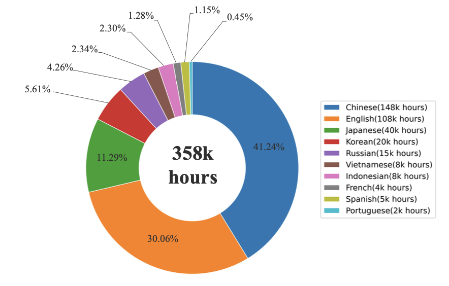
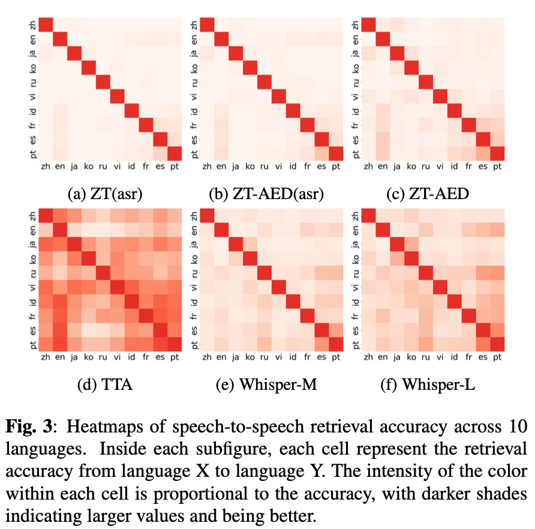

# TTA Example

This example demonstrates training and evaluating a Translate, Transcribe, and Align (TTA) model.

It follows the same layout as other examples and integrates with Auden's Auto* APIs and BaseTrainer.

## Data Configs

Edit YAMLs under `configs/` to point to your Lhotse CutSet `jsonl.gz` manifests.
See `data_module.py` docstring for a minimal supervision schema with optional translation.

## Training

Multi-GPU (8 GPUs):
```bash
torchrun --nproc_per_node=8 train.py \
  exp_dir=your/exp/dir \
  tokenizer=your/tokenizer/dir \
  model.model_type=tta \
  model.encoder.model_type=zipformer \
  data.train_data_config=configs/train_data_config.yaml \
  data.valid_data_config=configs/valid_data_config.yaml
```

## Evaluation (batch decoding)

RNNT ASR (greedy):
```bash
python evaluate.py \
  exp_dir=your/exp/dir \
  checkpoint.filename=your_model_file_name.pt \
  data.test_data_config=configs/test_data_config.yaml
```

## 🔥 Release of TTA-m10
### Training Data: 358k hours of public and in-house ASR/ST data
<p>
  
  
  
  
</p>

### 📊 Performance: Multilingual ASR & ST Results

| Model | #Params | AISHELL1/2 (CER↓) | Wenet (CER↓) | LibriSpeech (WER↓) | CommonVoice (WER↓) | MLS (WER↓) | VoxPopuli (WER↓) | FLEURS (WER↓) | CoVoSTv2 (BLEU↑) |
|--------|----------|------------------|---------------|---------------------|--------------------|-------------|-------------------|----------------|-------------------|
| **Whisper Medium** | 762M | 6.74 / 6.23 | 11.00 / 22.68 | 2.88 / 6.08 | 11.86 | 7.27 | 12.08 | 6.62 | 35.12 |
| **Whisper Large-v2** | 1.54B | 5.90 / 5.24 | 9.47 / 22.77 | 2.64 / 5.14 | 9.70 | 5.65 | 11.90 | 5.20 | **38.80** |
| **Whisper Large-v3** | 1.54B | 5.33 / 4.76 | 9.00 / 15.68 | 2.01 / 3.89 | 8.30 | 4.48 | 13.78 | 4.51 | 37.60 |
| **ZT (ASR)** | 199M | 1.89 / 3.14 | 6.91 / 6.08 | 1.58 / 3.62 | 6.92 | 5.82 | 11.12 | 6.35 | – |
| **ZT-AED (ASR)** | 246M | 1.82 / 3.07 | 6.89 / 6.18 | 1.54 / 3.59 | 6.70 | 5.71 | 10.78 | 6.18 | – |
| **ZT-AED (Full)** | 246M | 1.80 / 3.03 | 6.96 / 5.94 | 1.56 / 3.76 | 6.69 | 5.72 | 10.88 | 6.17 | 34.72 |
| **🔥 TTA (Ours)** | **247M** | **1.85 / 3.09** | **7.06 / 6.44** | **1.58 / 3.85** | **6.76** | **5.74** | **10.87** | **6.19** | **35.28** |

**Highlights:**
- TTA (<250M params) surpasses Whisper-Medium and matches Whisper-Large-v3 in many benchmarks.  
- Strong multilingual ASR (6.76% WER vs. 8.3% for Whisper-L3).  
- Competitive ST BLEU despite smaller capacity.  

---

### 🎧 Cross-Lingual Speech Retrieval

TTA shows significantly higher **retrieval accuracy** than Whisper Large-v2, especially among Indo-European languages — validating its **language-agnostic semantic alignment** capability.

<p>
  
  
  
  
</p>

---

### Usage

```python
from auden.auto.auto_model import AutoModel

# 1) Load a model checkpoint directory (contains config.json + weights)
model_dir = "AudenAI/auden-tta-m10"  # or any exported directory / HF repo id
model = AutoModel.from_pretrained(model_dir)
model = model.to("cuda")
model.eval()

# 2) Prepare input features (x, x_lens). If you have raw audio, you can use
#    model.speech_encoder.extract_feature(wav) to get (x, x_lens).
x, x_lens = ...  # Tensor shapes: (B, T, F), (B,)

inputs = (x, x_lens)
# Alternatively, you can pass WAV inputs directly:
# - List of WAV paths (str):
#   inputs = ["/abs/a.wav", "/abs/b.wav"]
# - List of mono waveforms (Tensor/ndarray), 16 kHz:
#   inputs = [torch.randn(16000*5), torch.randn(16000*3)]

# 3a) Transcribe (RNNT greedy)
out = model.generate(inputs, task="transcribe", blank_penalty=0.0, return_timestamps=False)
print(out["hypotheses"])  # list[str]

# 3b) Translate (attention beam search). Language can be a single str or a list[str] per utterance
out = model.generate(
    inputs,
    task="translate",
    beam_size=5,
    source_language=["zh"] * x.size(0),
    target_language=["en"] * x.size(0),
)
print(out["hypotheses"])      # list[str]
print(out["source_language"]) # list[str], model-predicted or provided
print(out["target_language"]) # list[str], model-predicted or provided

# 3c) Align (audio-text similarity)
texts = ["hello world", "good morning"]
out = model.generate(inputs, task="align", texts=texts)
print(out["similarities"])  # (B, len(texts))
print(out["audio_emb"]) # (B, emb_dim)
print(out["text_emb"]) # (B, emb_dim)

```

## 🧩 TTA Encoder 
### ASR-LLM Encoder Evaluation

| Encoder | Aishell CER↓ | LibriSpeech WER↓ |
|----------|---------------|------------------|
| Whisper-Medium | 5.47 | 4.66 |
| Whisper-Large | 4.87 | 3.64 |
| ZT-AED | 2.92 | 2.30 |
| **TTA (Ours)** | **1.92** | **1.95** |

TTA’s encoder achieves **state-of-the-art semantic representation**, enabling seamless LLM integration with high recognition accuracy.

### Usage
```python
from auden.auto.auto_model import AutoModel
encoder = AutoModel.from_pretrained("AudenAI/auden-encoder-tta-m10")
encoder = encoder.to("cuda")

# 2) Prepare input features (x, x_lens). If you have raw audio, you can use
#    encoder.extract_feature(wav) to get (x, x_lens).
x, x_lens = ...  # Tensor shapes: (B, T, F), (B,)

encoder_output = encoder(x, x_lens)
print(encoder_output.encoder_out) # (B, T//4, D)
print(encoder_output.encoder_out_lens) # (B)

```


